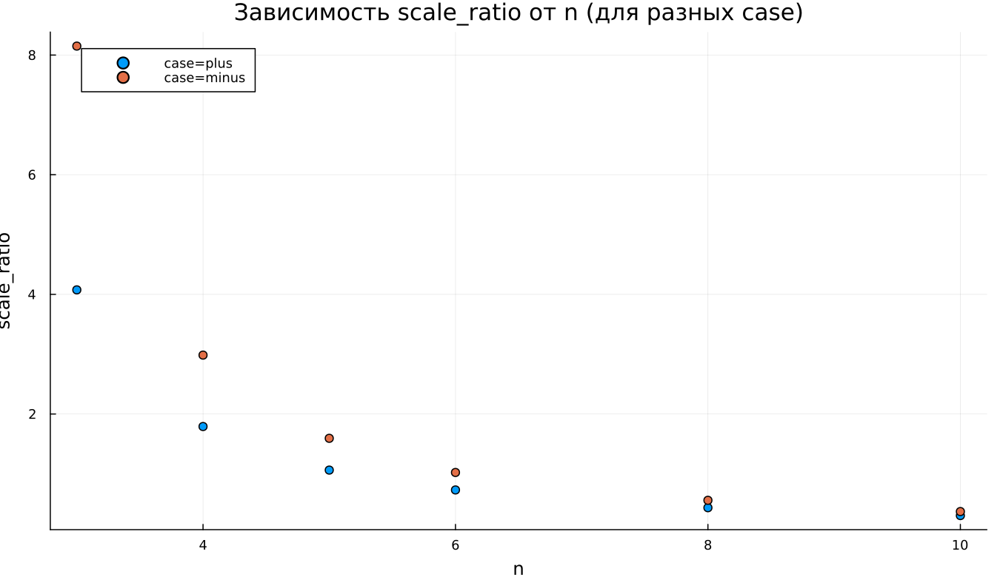

---
## Author
author:
  name: Абрикосов Артем
  email: 1132220833@rudn.ru
  affiliation:
    - name: Российский университет дружбы народов
      country: Российская Федерация
      postal-code: 117198
      city: Москва
      address: ул. Миклухо-Маклая, д. 6

## Title
title: "Математическое моделирование"
subtitle: "Лабораторная работа № 2"
license: "CC BY"
date: today
date-format: "YYYY-MM-DD"
---

# Введение

## Цель работы

Исследовать процесс построения математической модели для выбора рациональной стратегии преследования движущейся цели.

Рассматривается ситуация: в условиях тумана катер береговой охраны преследует лодку браконьеров. В момент кратковременной видимости лодка фиксируется на расстоянии $k$ км от катера, после чего вновь исчезает и продолжает движение по прямой в неизвестном направлении. Скорость катера превышает скорость лодки в $n$ раз.  

Необходимо определить закон движения катера, обеспечивающий гарантированный перехват.

## Задачи исследования

1. Обосновать модель и получить систему дифференциальных уравнений при отношении скоростей $n$.
2. Выполнить построение траекторий для двух вариантов начальных условий.
3. По результатам моделирования определить момент и точку встречи.

# Теоретическая часть

## Выбор системы координат

Положим начальный момент времени $t_0 = 0$.

В момент обнаружения:

- лодка расположена в начале координат: $X_0 = 0$,
- катер удалён на расстояние $k$.

Переходим к полярной системе координат:

- полюс совпадает с точкой обнаружения лодки,
- ось $r$ направлена в сторону катера.

## Определение начального радиуса

Пусть через время $t$ расстояние лодки от полюса равно $x$.  
Катер за то же время проходит путь $x - k$ или $x + k$.

Из равенства времён движения получаем два возможных варианта:

- **case = plus**
  $$
  x_1 = \frac{k}{n + 1}, \quad \theta_0 = 0
  $$

- **case = minus**
  $$
  x_2 = \frac{k}{n - 1}, \quad \theta_0 = -\pi
  $$

## Разложение скорости и вывод ОДУ

Полная скорость катера равна $n v$.  

Разложим её на компоненты:

- радиальная скорость  
  $$
  v_r = \frac{dr}{dt}
  $$

- тангенциальная скорость  
  $$
  v_\tau = r \frac{d\theta}{dt}
  $$

Из соотношения
$$
(n v)^2 = v_r^2 + v_\tau^2
$$

при условии $v_r = v$ получаем

$$
v_\tau = v \sqrt{n^2 - 1}.
$$

Следовательно, система принимает вид:

$$
\begin{cases}
\frac{dr}{dt} = v, \\
r \frac{d\theta}{dt} = v \sqrt{n^2 - 1}.
\end{cases}
$$

Исключая параметр $t$, получаем уравнение траектории:

$$
\frac{dr}{d\theta} = \frac{r}{\sqrt{n^2 - 1}}.
$$

Решение описывает логарифмическую спираль.

# Численный эксперимент

## Исходные данные

- расстояние обнаружения: $k = 20$ км;
- отношение скоростей: $n = 5$.

Цель моделирования — построить траектории и определить точку пересечения.

## Результаты для case = plus

### Анализ

- траектория катера имеет вид расходящейся спирали;
- радиус $r$ возрастает экспоненциально по углу $\theta$;
- лодка движется по лучу.

## Результаты для case = minus

### Анализ

- начальный радиус больше;
- спираль масштабирована наружу;
- характер движения сохраняется.

# Параметрическое исследование

## Влияние параметра $n$

Из уравнения
$$
\frac{dr}{d\theta} = \frac{r}{\sqrt{n^2 - 1}}
$$

следует:

- при меньших $n$ радиус увеличивается быстрее;
- при больших $n$ спираль становится более пологой;
- качественный тип траектории не изменяется.

## Метрика относительного масштаба

Введём показатель

$$
\text{scale\_ratio} = \frac{r_{\text{final}}}{\max(r_{\text{boat}})}.
$$

### Интерпретация

- при малых $n$ значение существенно превышает 1;
- при увеличении $n$ показатель уменьшается;
- в режиме case=minus значения выше из-за большего начального радиуса.

## Оценка времени расчёта

### Выводы по производительности

- среднее время решения порядка $6 \times 10^{-4}$ с;
- зависимость от параметра $n$ отсутствует;
- флуктуации обусловлены особенностями численной интеграции.

# Заключение

## Основные выводы

1. Траектория катера в полярных координатах представляет собой логарифмическую спираль.
2. Параметр $n$ определяет интенсивность радиального роста.
3. Начальные условия влияют на масштаб, но не изменяют характер кривой.
4. Численный метод демонстрирует устойчивость и малые вычислительные затраты.
