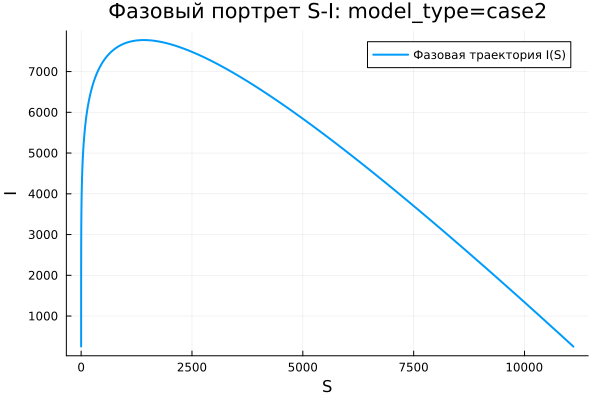

---
author:
  name: Абрикосов Артем
  email: 1132220833@rudn.ru
  affiliation:
    - name: Российский университет дружбы народов
      country: Российская Федерация
      city: Москва
title: "Математическое моделирование"
subtitle: "Лабораторная работа № 6"
license: "CC BY"
date: today
date-format: "YYYY-MM-DD"
---

# Вводная часть

## Цель работы

Рассмотреть эпидемиологическую модель $SIR$ и исследовать особенности изменения численности групп населения при распространении инфекции.

## Задание

1. Изучить модель эпидемии $SIR$.
2. Построить графики функций $S(t)$, $I(t)$ и $R(t)$.
3. Проанализировать два режима:
   - $I(0) \leq I^*$;
   - $I(0) > I^*$.
4. Выполнить параметрическое исследование модели.
5. Сравнить полученные результаты для двух вариантов системы.

# Теоретические сведения

## Модель $SIR$

В модели $SIR$ вся популяция делится на три группы:

- $S(t)$ — восприимчивые к заболеванию особи;
- $I(t)$ — инфицированные особи;
- $R(t)$ — выздоровевшие особи, обладающие иммунитетом.

Общее число особей в популяции задаётся выражением:

$$
N = S(t) + I(t) + R(t).
$$

## Основная идея модели

Модель описывает последовательный переход особей между состояниями:

$$
S \rightarrow I \rightarrow R.
$$

Сначала здоровые восприимчивые особи заражаются и переходят в группу $I$. Затем инфицированные выздоравливают и переходят в группу $R$.

## Условие изоляции

Пусть $I^*$ — критическое число инфицированных.

Если выполняется условие:

$$
I(t) \leq I^*,
$$

то считаем, что заболевшие изолированы и не заражают восприимчивых особей.

Если же:

$$
I(t) > I^*,
$$

то инфекция начинает распространяться среди восприимчивой части населения.

## Уравнение для $S(t)$

Изменение числа восприимчивых особей описывается системой:

$$
\frac{dS}{dt} =
\begin{cases}
-\alpha S, & I(t) > I^*, \\
0, & I(t) \leq I^*.
\end{cases}
$$

## Уравнение для $I(t)$

Для числа инфицированных получаем:

$$
\frac{dI}{dt} =
\begin{cases}
\alpha S - \beta I, & I(t) > I^*, \\
-\beta I, & I(t) \leq I^*.
\end{cases}
$$

## Уравнение для $R(t)$

Число выздоровевших изменяется по закону:

$$
\frac{dR}{dt} = \beta I.
$$

Здесь:

- $\alpha$ — коэффициент заражения;
- $\beta$ — коэффициент выздоровления.

# Постановка задачи

## Исходные данные

Рассматривается эпидемия на изолированном острове.

Заданы значения:

$$
N = 11400,
$$

$$
I(0) = 250,
$$

$$
R(0) = 47.
$$

## Начальное значение $S(0)$

Число восприимчивых особей в начальный момент времени определяется как:

$$
S(0) = N - I(0) - R(0).
$$

После подстановки исходных данных:

$$
S(0) = 11400 - 250 - 47 = 11103.
$$

## Рассматриваемые режимы

В работе анализируются два случая:

1. $I(0) \leq I^*$ — начальное число заболевших не превышает критический уровень.
2. $I(0) > I^*$ — начальное число заболевших больше критического уровня.

# Базовые эксперименты

## Первая модель: временная динамика

## Первая модель: фазовый портрет

## Анализ первой модели

Для первой модели наблюдается нестандартная динамика:

- значение $S(t)$ остаётся неизменным;
- число инфицированных $I(t)$ быстро возрастает;
- величина $R(t)$ уменьшается и может принимать отрицательные значения;
- в системе отсутствует механизм ограничения роста инфекции.

## Вывод по первой модели

Первая модель не отражает физический смысл классической модели $SIR$.

Основная особенность состоит в том, что:

$$
S(t) = const.
$$

Из-за этого восприимчивые особи не расходуются, а число инфицированных увеличивается без естественного ограничения.

# Вторая модель

## Вторая модель: временная динамика

## Вторая модель: фазовый портрет

## Анализ второй модели

Во второй модели поведение системы соответствует типичной эпидемической динамике:

- $S(t)$ постепенно уменьшается;
- $I(t)$ сначала возрастает;
- затем $I(t)$ достигает максимума;
- после максимума число инфицированных убывает;
- $R(t)$ монотонно увеличивается.

## Интерпретация второй модели

В начале эпидемии заражение происходит активно, так как число восприимчивых особей велико.

Позже количество восприимчивых уменьшается, скорость распространения инфекции падает, и эпидемия затухает:

$$
I(t) \rightarrow 0.
$$

# Сравнение базовых моделей

## Качественное различие моделей

| Характеристика | Первая модель | Вторая модель |
|---|---|---|
| $S(t)$ | остаётся постоянным | убывает |
| $I(t)$ | растёт без ограничения | имеет конечный максимум |
| $R(t)$ | может становиться отрицательным | возрастает |
| Фазовый портрет | вырожденная вертикальная линия | незамкнутая кривая |
| Физическая интерпретация | нарушается | сохраняется |

# Параметрическое исследование

## Сканирование траекторий $S(t)$

## Анализ траекторий $S(t)$

Для первой модели:

- $S(t)$ не зависит от времени;
- изменение параметров почти не влияет на восприимчивую группу.

Для второй модели:

- $S(t)$ монотонно уменьшается;
- при увеличении параметра $a$ спад становится быстрее.

## Сканирование траекторий $I(t)$

## Анализ траекторий $I(t)$

Для первой модели:

- наблюдается экспоненциальный рост $I(t)$;
- увеличение параметра $b$ ускоряет рост инфицированных.

Для второй модели:

- формируется эпидемическая волна;
- $I(t)$ достигает пика;
- после пика число инфицированных уменьшается.

## Сканирование траекторий $R(t)$

## Анализ траекторий $R(t)$

Для первой модели:

- значения $R(t)$ становятся нефизичными;
- возможен уход $R(t)$ в отрицательную область.

Для второй модели:

- число выздоровевших постепенно увеличивается;
- $R(t)$ выходит на конечный уровень;
- накопление выздоровевших соответствует смыслу модели $SIR$.

## Фазовые траектории

## Анализ фазовых траекторий

Фазовые портреты показывают различие между моделями:

- в первой модели траектории вырождаются в вертикальные линии;
- во второй модели фазовые кривые имеют характерную форму для $SIR$-процесса;
- сначала $I$ увеличивается при уменьшении $S$;
- затем $I$ снижается, а $S$ продолжает уменьшаться.

# Анализ итоговых метрик

## Метрика $\text{norm\_final}$

Для оценки состояния системы в конце моделирования использовалась метрика:

$$
\text{norm\_final} =
\sqrt{
S(t_{final})^2 +
I(t_{final})^2 +
R(t_{final})^2
}.
$$

Она позволяет сравнить итоговые значения переменных для разных параметров.

## Зависимость $\text{norm\_final}$ от параметра

## Интерпретация $\text{norm\_final}$

Для первой модели:

- значение метрики быстро увеличивается;
- основной причиной является резкий рост $I(t)$;
- отрицательные значения $R(t)$ также увеличивают норму по модулю.

Для второй модели:

- значения метрики ниже;
- изменение происходит более плавно;
- система стремится к конечному устойчивому состоянию.

# Максимальное число инфицированных

## Зависимость $I_{max}$ от параметра

## Анализ $I_{max}$

Для первой модели:

- максимум инфицированных принимает очень большие значения;
- рост $I_{max}$ не ограничивается численностью популяции.

Для второй модели:

- максимум инфицированных остаётся конечным;
- величина пика зависит от параметра $a$;
- при большем $a$ пик достигается быстрее.

# Анализ вычислений

## Время вычислений

## Интерпретация времени вычислений

Проведённый бенчмаркинг показал:

- обе модели решаются численно достаточно быстро;
- характерное время вычислений имеет порядок $10^{-4}$ секунды;
- изменение параметров почти не влияет на вычислительную сложность;
- используемый численный метод работает устойчиво и эффективно.

# Итоги

## Основные результаты

1. Первая модель демонстрирует нефизичное поведение системы.
2. В первой модели число инфицированных растёт без ограничения.
3. Вторая модель воспроизводит реалистичную эпидемическую волну.
4. Во второй модели эпидемия постепенно затухает.
5. Для второй модели выполняется предельное поведение:

$$
I(t) \to 0.
$$

6. Фазовые портреты подтверждают качественное различие между моделями.

## Выводы

1. Модель case1 нельзя считать адекватной для описания реальной эпидемии.
2. Модель case2 соответствует логике классического $SIR$-процесса.
3. Параметры $a$ и $b$ влияют на скорость изменения групп населения.
4. Метрики $\text{norm\_final}$ и $I_{max}$ позволяют количественно сравнить модели.
5. Численное решение обеих систем выполняется эффективно.
6. Наиболее содержательной с точки зрения эпидемиологической интерпретации является вторая модель.

# Список литературы {.unnumbered}

1. [Конструирование эпидемиологических моделей](https://habr.com/ru/post/551682/)
2. [Зараза, гостья наша](https://nplus1.ru/material/2019/12/26/epidemic-math)
