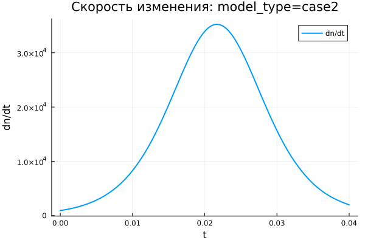
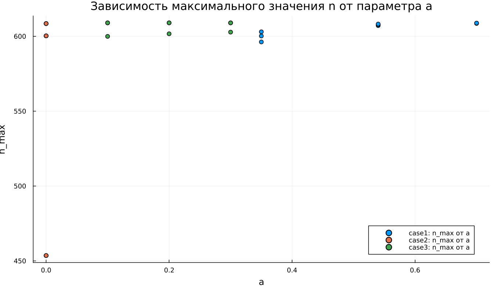

---
author:
  name: Абрикосов Артем
  email: 1132220833@rudn.ru
  affiliation:
    - name: Российский университет дружбы народов
      country: Российская Федерация
      city: Москва
title: "Математическое моделирование"
subtitle: "Лабораторная работа №7"
license: "CC BY"
date: today
date-format: "YYYY-MM-DD"
---

# Вводная часть

## Цель работы

Рассмотреть модель эффективности рекламной кампании и проанализировать, как информация о товаре распространяется среди потенциальных покупателей.

## Задание

1. Рассмотреть математическую модель распространения рекламы.
2. Построить графики изменения числа информированных покупателей для трёх случаев.
3. Проанализировать скорость распространения информации.
4. Выполнить параметрическое исследование модели.
5. Сопоставить результаты для трёх вариантов уравнения.

# Теоретические сведения

## Модель распространения рекламы

Введём обозначения:

- $N$ — общее количество потенциальных покупателей;
- $n(t)$ — число покупателей, уже знающих о товаре к моменту времени $t$;
- $t$ — время, прошедшее с начала рекламной кампании;
- $\frac{dn}{dt}$ — скорость изменения числа информированных покупателей.

## Основная идея модели

Информация о товаре распространяется двумя путями:

1. Через прямое рекламное воздействие.
2. Через общение покупателей друг с другом.

Общий вид модели задаётся уравнением:

$$
\frac{dn}{dt} =
(\alpha_1(t) + \alpha_2(t)n(t))(N - n(t)).
$$

## Смысл множителей

Множитель $(N - n(t))$ отражает количество покупателей, которые ещё не получили информацию о товаре.

Когда $n(t)$ приближается к $N$, выполняется соотношение:

$$
N - n(t) \rightarrow 0.
$$

Из-за этого скорость распространения рекламы постепенно уменьшается.

## Уровень насыщения

Величина $N$ задаёт предельный уровень охвата аудитории:

$$
n(t) \rightarrow N.
$$

Если $n = N$, все потенциальные покупатели уже знают о товаре. Следовательно, дальнейшее распространение информации прекращается, а скорость изменения становится равной нулю.

# Постановка задачи

## Исходные данные

В работе используются следующие значения:

$$
N = 609,
$$

$$
n(0) = 4.
$$

Необходимо построить графики $n(t)$ для трёх вариантов модели распространения рекламы.

## Первая модель

$$
\frac{dn}{dt} =
(0.54 + 0.00016n(t))(N - n(t)).
$$

В первой модели основной вклад в распространение информации вносит рекламная кампания, а влияние общения между покупателями выражено слабее.

## Вторая модель

$$
\frac{dn}{dt} =
(0.000021 + 0.38n(t))(N - n(t)).
$$

Во второй модели решающую роль играет передача информации от уже информированных покупателей к тем, кто ещё не знает о товаре.

## Третья модель

$$
\frac{dn}{dt} =
(0.2\cos t + 0.2\cos 2t \cdot n(t))(N - n(t)).
$$

В третьей модели коэффициенты зависят от времени, поэтому интенсивность распространения информации меняется в ходе процесса.

# Базовые эксперименты

## Первая модель: динамика $n(t)$

## Первая модель: скорость изменения

## Первая модель: фазовая траектория

## Анализ первой модели

В первой модели функция $n(t)$ возрастает монотонно.

Основные свойства процесса:

- значение $n(t)$ постепенно приближается к уровню $N = 609$;
- наибольшая скорость роста наблюдается в начале моделирования;
- затем скорость последовательно уменьшается;
- решение остаётся ниже уровня насыщения и не превышает его.

## Вывод по первой модели

Первая модель описывает процесс насыщаемого роста.

По мере приближения $n(t)$ к $N$ множитель $(N - n)$ становится всё меньше, поэтому:

$$
\frac{dn}{dt} \rightarrow 0.
$$

Состояние $n = N$ является равновесным, так как после полного охвата аудитории дальнейший рост невозможен.

# Вторая модель

## Вторая модель: динамика $n(t)$

## Вторая модель: скорость изменения

## Вторая модель: фазовая траектория

## Анализ второй модели

Во второй модели рост числа информированных покупателей происходит значительно быстрее.

Кривая $n(t)$ имеет S-образный вид:

- в начале рост остаётся сравнительно медленным;
- затем процесс резко ускоряется;
- после достижения максимальной скорости начинается замедление;
- решение быстро приближается к уровню $N$.

## Максимальная скорость

Для второй модели скорость распространения рекламы имеет чётко выраженный максимум.

Это объясняется взаимодействием двух факторов:

- множитель $bn$ усиливает распространение информации;
- множитель $(N - n)$ ограничивает дальнейший рост.

Максимальная скорость достигается не в начале процесса, а внутри рассматриваемого интервала, когда число информированных покупателей уже достаточно велико.

# Третья модель

## Третья модель: динамика $n(t)$

## Третья модель: скорость изменения

## Третья модель: фазовая траектория

## Анализ третьей модели

Третья модель также приводит систему к насыщению.

Её особенность заключается в наличии тригонометрических коэффициентов:

$$
\cos t,\quad \cos 2t.
$$

На выбранном коротком промежутке времени эти функции остаются положительными. Поэтому решение не переходит к колебательному режиму, а продолжает монотонно возрастать.

## Вывод по третьей модели

Третья модель описывает насыщаемый рост с коэффициентами, зависящими от времени.

Несмотря на присутствие функций $\cos t$ и $\cos 2t$, общий характер динамики сохраняется:

$$
n(t) \rightarrow N.
$$

Система быстро приближается к уровню насыщения, после чего скорость изменения стремится к нулю.

# Сравнение базовых моделей

## Качественное различие

| Характеристика | case1 | case2 | case3 |
|---|---|---|---|
| Вид роста | монотонный | S-образный | S-образный |
| Скорость в начале | максимальная | малая | малая |
| Максимум $dn/dt$ | в начальный момент | внутри интервала | внутри интервала |
| Предельное значение | $N$ | $N$ | $N$ |
| Коэффициенты | постоянные | постоянные | зависят от времени |

## Общая особенность

Во всех трёх уравнениях присутствует множитель:

$$
N - n(t).
$$

Именно он ограничивает рост и обеспечивает выход системы к уровню насыщения. Благодаря этому решение не может бесконечно увеличиваться.

# Параметрическое исследование

## Зависимость $n_{final}$ от параметра $a$

## Анализ зависимости $n_{final}(a)$

Большинство точек находится рядом с уровнем $N = 609$.

Это показывает, что при большей части рассмотренных параметров модель успевает выйти к насыщению за заданный расчётный интервал.

Исключение появляется во второй модели при малом значении параметра $a$. В этом случае рост оказывается недостаточно быстрым, поэтому итоговое значение остаётся ниже предельного уровня.

## Зависимость $n_{final}$ от параметра $b$

## Анализ зависимости $n_{final}(b)$

Параметр $b$ отвечает за влияние общения между покупателями.

При увеличении $b$ информация распространяется быстрее, поскольку уже информированные покупатели активнее вовлекают остальных.

Если значение $b$ недостаточно велико, система может не успеть достичь уровня $N$ за выбранное время моделирования.

# Максимальные значения

## Зависимость $n_{max}$ от параметра $a$

## Зависимость $n_{max}$ от параметра $b$

## Анализ $n_{max}$

Во всех базовых экспериментах решения возрастают монотонно. Поэтому максимальное значение $n_{max}$ почти совпадает с итоговым значением $n_{final}$.

Если система выходит на насыщение, выполняется приближённое равенство:

$$
n_{max} \approx N.
$$

Если расчётного интервала недостаточно, то $n_{max}$ остаётся заметно ниже уровня $N$.

# Финальное насыщение

## Зависимость насыщения от параметра $a$

## Зависимость насыщения от параметра $b$

## Метрика насыщения

Для оценки степени выхода к предельному уровню использовалась метрика:

$$
\text{saturation\_final} =
\frac{n_{final}}{N}.
$$

Если эта величина близка к $1$, система практически достигла насыщения.

## Интерпретация насыщения

Для большинства проведённых экспериментов выполняется:

$$
\frac{n_{final}}{N} \approx 1.
$$

Это означает почти полный охват потенциальной аудитории.

Пониженные значения метрики указывают на то, что переходный процесс ещё не завершился к концу расчётного интервала.

# Бенчмаркинг

## Время решения от параметра $a$

## Время решения от параметра $b$

## Анализ времени вычислений

Результаты бенчмаркинга показывают:

- все три модели решаются за малое время;
- время вычислений имеет порядок $10^{-5}$ секунды;
- изменение параметров почти не влияет на вычислительные затраты;
- третья модель немного сложнее из-за вычисления функций $\cos t$ и $\cos 2t$.

# Итоги

## Основные результаты

1. Все три модели описывают рост с последующим насыщением.
2. Предельный уровень охвата равен $N = 609$.
3. В первой модели скорость максимальна в начальный момент времени.
4. Вторая модель даёт наиболее резкий S-образный рост.
5. Третья модель учитывает временную зависимость коэффициентов.

## Выводы

1. Первая модель (case1) описывает монотонное приближение $n(t)$ к предельному уровню $N$.

2. Вторая модель (case2) демонстрирует S-образный рост и содержит внутреннюю точку, в которой скорость распространения рекламы максимальна.

3. Третья модель (case3) также приводит к насыщению, но использует коэффициенты, изменяющиеся во времени.

4. Параметры $a$ и $b$ в первую очередь определяют скорость выхода системы к уровню насыщения.

5. Метрики $n_{final}$, $n_{max}$ и $\text{saturation\_final}$ позволяют количественно сравнить результаты для разных моделей и наборов параметров.

6. Численное решение всех трёх моделей выполняется быстро, поэтому вычислительные затраты остаются небольшими.

# Список литературы {.unnumbered}

1. [Модель Мальтуса](http://km.mmf.bsu.by/courses/2018/mathmod1/MM_LB1_Population_2019.pdf)
2. [Логистическая модель роста](https://studopedia.ru/29_5129_logisticheskaya-model-rosta.html)
